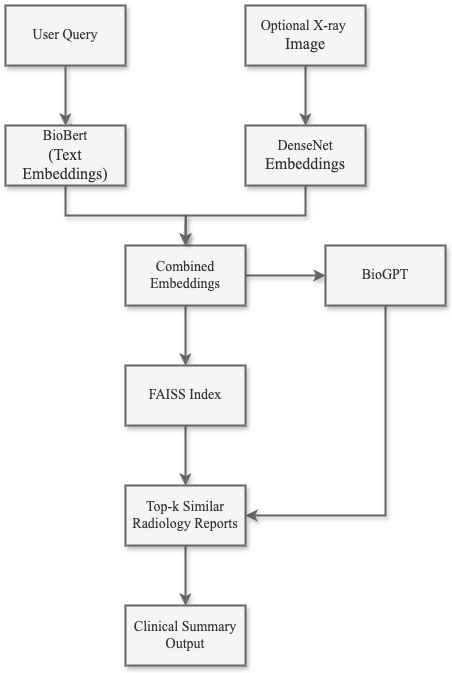

# X-RayGPT: A Biomedical RAG Chatbot for Radiology Report Generation and Severity Prediction

**X-RayGPT** is a multimodal Retrieval-Augmented Generation (RAG) pipeline that combines radiology reports and chest X-ray images to generate clinical summaries, predict severity levels, and assist in diagnostic reasoning.

---

## 🚀 Project Overview

This project uses:
- **LLMs (BioGPT)** for medical language generation
- **DenseNet-121** for extracting visual features from X-rays
- **BioBERT** for encoding radiology reports
- **FAISS** for fast similarity search over multimodal embeddings
- **Gradio UI** for an interactive chatbot experience

Users can input a **clinical query** with or without an uploaded **chest X-ray image**, and the system returns a **diagnostic summary** based on similar historical cases.

---

## 🧱 Architecture

---

## 📦 Dataset

Dataset used:  
**[Indiana University Chest X-rays](https://openi.nlm.nih.gov/)**  
- Includes paired chest X-ray images and radiologist reports.

---

## 📈 Project Highlights
Indexed over 3,300 radiology cases with multimodal embeddings

Combined vision and language for retrieval-augmented diagnostics

Enabled contextual LLM responses using clinical prompts

---

## Acknowledgements
Microsoft for BioGPT

NIH & Indiana University for the dataset

Hugging Face Transformers

Gradio for the UI framework
